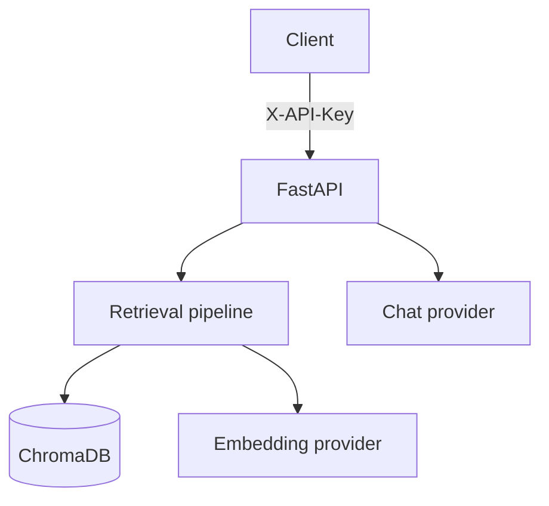

<div align="center">

# Maux RAG API

**OpenAI-compatible RAG API with persistent ChromaDB, hybrid retrieval, Persian-aware query analysis, and pluggable chat/embedding providers.**

[فارسی](#معرفی) · [English](#english) · [API Reference](#مرجع-api) · [Benchmarks](#بنچمارک-و-تستها)

</div>

---

<div dir="rtl">

## معرفی

Maux RAG API یک سرویس مبتنی بر FastAPI برای ساخت سامانه‌های **Retrieval-Augmented Generation** است. این پروژه اسناد متنی را به چانک‌های ساختاریافته تقسیم می‌کند، embedding آن‌ها را در ChromaDB نگه می‌دارد، مرتبط‌ترین بخش‌ها را با ترکیب جست‌وجوی برداری و بازرتبه‌بندی واژگانی پیدا می‌کند و سپس context بازیابی‌شده را به مدل زبانی می‌فرستد.

اندپوینت `POST /v1/chat/completions` با قالب OpenAI سازگار است؛ بنابراین در بسیاری از کلاینت‌های موجود فقط کافی است `base_url` و هدر `X-API-Key` را تغییر دهید.

### قابلیت‌های فعلی

- FastAPI و ChromaDB پایدار روی دیسک
- پشتیبانی از OpenAI، AvalAI و OpenRouter برای چت
- جداسازی provider چت از provider امبدینگ
- سرویس مستقل embedding محلی با مدل قابل تنظیم Hugging Face
- چانکینگ قطعی و ساختارمحور بر اساس section، heading، paragraph و sentence
- پشتیبانی از متن فارسی/عربی و نرمال‌سازی ارقام فارسی
- metadata استاندارد برای `document_id`، شماره چانک، source، section، page و سال‌های موجود
- upsert با شناسه‌های قطعی؛ درج دوباره همان `document_id` رکورد تکراری تولید نمی‌کند
- جست‌وجوی hybrid با dense retrieval، lexical boost، فیلتر سال، metric و section
- تحلیل queryهای exact value، comparison، trend، multi-year، semantic و negative
- پاسخ‌های streaming و non-streaming با قالب OpenAI
- endpoint تحلیل هوشمند با fallback و confidence
- احراز هویت fail-closed با هدر `X-API-Key` روی تمام endpointهای برنامه
- health/status endpoint و مجموعه تست/benchmark

## معماری



provider چت می‌تواند OpenAI، AvalAI یا OpenRouter باشد. embedding نیز می‌تواند از همان provider یا از microservice محلی استفاده کند. اسناد و queryها باید همیشه با یک مدل embedding تولید شوند؛ تغییر مدل روی collection موجود بدون re-index باعث ناسازگاری فضای برداری می‌شود.

## پیش‌نیازها

- Python 3.10 یا جدیدتر
- یک کلید معتبر برای provider چت انتخاب‌شده
- یک مقدار قوی و تصادفی برای `RAG_API_KEY`
- در حالت embedding محلی: منابع کافی برای اجرای PyTorch/Transformers

## نصب

```bash
git clone https://github.com/MassoudKargar/RAG.git
cd RAG

python3 -m venv .venv
source .venv/bin/activate
pip install -r requirements.txt
```

در Windows PowerShell:

```powershell
python -m venv .venv
.venv\Scripts\Activate.ps1
pip install -r requirements.txt
```

## تنظیم متغیرهای محیطی

یک فایل `.env` در ریشه پروژه بسازید. کلید واقعی را commit نکنید.

### حالت پیشنهادی: OpenRouter برای چت + embedding محلی

```dotenv
PROVIDER=openrouter
OPENROUTER_API_KEY=sk-or-your-key
OPENROUTER_BASE_URL=https://openrouter.ai/api/v1
OPENROUTER_CHAT_MODEL=deepseek/deepseek-v4-flash-0731

# در schema فعلی Settings این متغیر الزامی است، حتی وقتی provider=openrouter است.
OPENAI_API_KEY=unused

EMBEDDING_PROVIDER=local
LOCAL_EMBEDDING_MODEL=xmanii/maux-gte-persian
LOCAL_EMBEDDING_API_URL=http://127.0.0.1:8010/embed

RAG_API_KEY=replace-with-a-long-random-secret
CHROMA_PERSIST_DIRECTORY=./chroma_db

RAG_RETRIEVAL_K=10
RAG_RETRIEVAL_CANDIDATES=800
RAG_FINAL_K=3
RAG_SEARCH_LIMIT=3
RAG_CHUNK_SIZE=800
RAG_CHUNK_OVERLAP=100
RAG_EMBEDDING_BATCH_SIZE=32

SYSTEM_PROMPT="Use only the provided context when it is relevant. If the answer is not supported by the context, say I don't know."
```

> مقدار پیش‌فرض داخل `embedding_service/embedder.py` مدل `intfloat/multilingual-e5-small` است. برای استفاده از مدل فارسی پروژه، `LOCAL_EMBEDDING_MODEL=xmanii/maux-gte-persian` را برای **فرآیند embedding service** نیز export کنید.

### حالت OpenAI

```dotenv
PROVIDER=openai
OPENAI_API_KEY=sk-your-key
OPENAI_EMBEDDING_MODEL=text-embedding-3-small
CHAT_MODEL=gpt-4o-mini
RAG_API_KEY=replace-with-a-long-random-secret
CHROMA_PERSIST_DIRECTORY=./chroma_db
```

### حالت AvalAI

```dotenv
PROVIDER=avalai
OPENAI_API_KEY=unused
AVALAI_API_KEY=your-avalai-key
AVALAI_BASE_URL=https://api.avalapis.ir/v1
OPENAI_EMBEDDING_MODEL=text-embedding-3-small
CHAT_MODEL=gpt-4o-mini
RAG_API_KEY=replace-with-a-long-random-secret
CHROMA_PERSIST_DIRECTORY=./chroma_db
```

### متغیرهای مهم

| متغیر | پیش‌فرض | کاربرد |
|---|---:|---|
| `PROVIDER` | `openai` | provider چت: `openai`، `avalai` یا `openrouter` |
| `EMBEDDING_PROVIDER` | مقدار `PROVIDER` | provider امبدینگ: `openai`، `avalai`، `openrouter` یا `local` |
| `RAG_API_KEY` | خالی | کلید دسترسی API؛ مقدار خالی باعث 401 شدن همه درخواست‌ها می‌شود |
| `CHROMA_PERSIST_DIRECTORY` | `./chroma_db` | محل ذخیره persistent دیتابیس برداری |
| `RAG_RETRIEVAL_K` | `10` | بودجه اولیه retrieval |
| `RAG_RETRIEVAL_CANDIDATES` | `800` | candidate pool قبل از lexical re-rank |
| `RAG_FINAL_K` | `3` | تعداد چانک‌های نهایی داخل context |
| `RAG_CHUNK_SIZE` | `800` | اندازه تقریبی چانک بر حسب کاراکتر |
| `RAG_CHUNK_OVERLAP` | `100` | overlap چانک‌ها بر حسب کاراکتر |
| `RAG_EMBEDDING_BATCH_SIZE` | `32` | اندازه batch هنگام embedding و storage |
| `RAG_CORPORA_YEARS` | خالی | فهرست اختیاری سال‌های corpus برای فیلتر year-aware |

## اجرای embedding محلی

این سرویس dependencyهای سنگین ML را از API اصلی جدا نگه می‌دارد.

```bash
python3 -m venv embedding_service/.venv
embedding_service/.venv/bin/pip install -r embedding_service/requirements.txt

export LOCAL_EMBEDDING_MODEL=xmanii/maux-gte-persian
export LOCAL_EMBEDDING_MAX_LENGTH=512

embedding_service/.venv/bin/uvicorn embedding_service.main:app \
  --host 127.0.0.1 \
  --port 8010
```

بررسی سلامت سرویس:

```bash
curl http://127.0.0.1:8010/health
```

## اجرای API

```bash
uvicorn app.main:app --host 0.0.0.0 --port 8000
```

بررسی سلامت API:

```bash
curl http://127.0.0.1:8000/v1/health \
  -H "X-API-Key: $RAG_API_KEY"
```

collection در startup به‌صورت خودکار ساخته یا بازیابی می‌شود؛ فراخوانی دستی `initialize_collection` اختیاری است.

## شروع سریع

### ۱. افزودن سند با چانکینگ

برای اسناد واقعی از `/documents` استفاده کنید. این endpoint متن کامل را chunk، embed و upsert می‌کند.

```bash
curl -X POST http://127.0.0.1:8000/v1/vector_db/documents \
  -H "Content-Type: application/json" \
  -H "X-API-Key: $RAG_API_KEY" \
  -d '{
    "text": "درآمد شرکت در سال ۲۰۲۵ برابر با ۲۸۱٬۷۲۴ میلیون دلار بود.",
    "source": "annual-report-2025.txt",
    "metadata": {
      "document_id": "annual-report-2025",
      "company": "example-company",
      "fiscal_year": 2025,
      "document_type": "annual_report"
    }
  }'
```

نمونه پاسخ:

```json
{
  "document_id": "annual-report-2025",
  "chunks_added": 1,
  "chunk_ids": ["annual-report-2025::chunk_00000"],
  "message": "Document embedded and added successfully (1 chunks)"
}
```

### ۲. جست‌وجوی اسناد

پارامتر `limit` در query string ارسال می‌شود.

```bash
curl -X POST "http://127.0.0.1:8000/v1/vector_db/search_documents?limit=5" \
  -H "Content-Type: application/json" \
  -H "X-API-Key: $RAG_API_KEY" \
  -d '{"prompt":"درآمد سال ۲۰۲۵ چقدر بود؟"}'
```

در فیلد `score` فاصله ChromaDB برگردانده می‌شود؛ مقدار کمتر به معنی شباهت بیشتر است.

### ۳. استفاده با OpenAI Python Client

```python
import os
from openai import OpenAI

client = OpenAI(
    base_url="http://127.0.0.1:8000/v1",
    api_key="not-used-by-maux",
    default_headers={"X-API-Key": os.environ["RAG_API_KEY"]},
)

response = client.chat.completions.create(
    model="deepseek/deepseek-v4-flash-0731",
    messages=[
        {"role": "user", "content": "درآمد سال ۲۰۲۵ چقدر بود؟"}
    ],
)

print(response.choices[0].message.content)
```

### ۴. پاسخ streaming

```python
import os
from openai import OpenAI

client = OpenAI(
    base_url="http://127.0.0.1:8000/v1",
    api_key="not-used-by-maux",
    default_headers={"X-API-Key": os.environ["RAG_API_KEY"]},
)

stream = client.chat.completions.create(
    model="deepseek/deepseek-v4-flash-0731",
    messages=[{"role": "user", "content": "روند درآمد را توضیح بده."}],
    stream=True,
)

for chunk in stream:
    content = chunk.choices[0].delta.content
    if content:
        print(content, end="", flush=True)
```

### ۵. تحلیل هوشمند با fallback

`query` و `use_rag` پارامترهای query string هستند، نه JSON body.

```bash
curl -X POST \
  "http://127.0.0.1:8000/v1/analysis/query?query=درآمد%20سال%202025%20چقدر%20بود؟&use_rag=true" \
  -H "X-API-Key: $RAG_API_KEY"
```

پاسخ علاوه بر متن شامل `used_rag_context`، `confidence`، `fallback_reason` و `metadata` است.

## مرجع API

تمام endpointهای زیر به هدر `X-API-Key` نیاز دارند.

| Method | Path | توضیح |
|---|---|---|
| `GET` | `/` | پیام معرفی سرویس |
| `GET` | `/v1/health` | سلامت RAG و analysis service |
| `GET` | `/v1/analysis/status` | وضعیت analysis، fallback و MCP |
| `POST` | `/v1/analysis/query` | تحلیل query با RAG یا fallback |
| `POST` | `/v1/chat/completions` | چت سازگار با OpenAI، streaming و non-streaming |
| `POST` | `/v1/vector_db/initialize_collection` | ساخت یا دریافت collection |
| `POST` | `/v1/vector_db/add_document` | API قدیمی افزودن متن؛ اکنون همان pipeline چانکینگ را صدا می‌زند |
| `POST` | `/v1/vector_db/documents` | ingestion پیشنهادی با metadata و شناسه سند |
| `POST` | `/v1/vector_db/search_documents` | semantic/hybrid search |
| `DELETE` | `/v1/vector_db/clear_collection` | حذف تمام محتوای collection |

> `DELETE /clear_collection` مخرب است و کل collection را پاک می‌کند. در نسخه فعلی endpoint عمومی برای حذف انتخابی یک `document_id` وجود ندارد.

## رفتار retrieval

pipeline فعلی فقط یک similarity search ساده نیست:

1. query فارسی/انگلیسی و ارقام نرمال می‌شوند.
2. سال، metric، شرکت و intent استخراج می‌شود.
3. candidateها از ChromaDB بازیابی می‌شوند.
4. exact tokens، شناسه‌ها، metricها و sectionهای مرتبط lexical boost می‌گیرند.
5. فیلترهای سال و corpus از پاسخ‌های خارج از محدوده جلوگیری می‌کنند.
6. حداکثر `RAG_FINAL_K` چانک به context مدل زبانی فرستاده می‌شود.

## بنچمارک و تست‌ها

آخرین گزارش ثبت‌شده در repository برای retrieval-only:

| معیار | نتیجه |
|---|---:|
| تعداد checkها | 103 |
| Failed | 0 |
| Exact Recall@1 | 0.96 |
| Exact Recall@5 / @10 | 1.00 / 1.00 |
| MRR | 0.973 |
| Semantic | 1.00 |
| Multi-year | 1.00 |
| Persian Recall@5 | 1.00 |
| Year attribution | 0.889 |
| Latency p50 / p95 / p99 | 187ms / 238ms / 803ms |

مجموعه تست ثبت‌شده شامل **78 تست پاس‌شده** برای chunking، E2E retrieval، query analyzer، section retrieval، table retrieval، negative guard و cross-document retrieval است.

```bash
pip install pytest
pytest -q
```

جزئیات بیشتر در فایل‌های `docs/PHASE*.md`، `docs/*BENCHMARK*.json` و `docs/PRODUCTION_TEST_REPORT.md` قرار دارد.

## محدودیت‌های فعلی

- API اصلی فایل باینری دریافت نمی‌کند؛ ورودی ingestion در حال حاضر **متن داخل JSON** است.
- parsing مستقیم PDF/DOCX، URL ingestion و batch upload در این repository پیاده‌سازی نشده‌اند.
- citation ساختاریافته در پاسخ `chat/completions` برگردانده نمی‌شود.
- reranker مبتنی بر cross-encoder وجود ندارد؛ بازرتبه‌بندی فعلی rule/lexical-based است.
- MCP در وضعیت experimental scaffold است و فراخوانی واقعی MCP هنوز پیاده‌سازی نشده؛ در عمل از provider تنظیم‌شده fallback می‌کند.
- تغییر embedding model یا dimension نیازمند re-index کردن collection است.
- `clear_collection` مجوز جداگانه admin ندارد و هر دارنده `RAG_API_KEY` می‌تواند آن را فراخوانی کند.
- فایل `LICENSE` در repository موجود نیست؛ تا زمان افزودن آن نباید نوع مجوز پروژه را MIT فرض کرد.

## امنیت

- `.env`، کلیدها و دیتابیس محلی را commit نکنید.
- API را مستقیماً روی اینترنت باز نکنید؛ از TLS، reverse proxy، rate limiting و محدودیت شبکه استفاده کنید.
- برای محیط production یک `RAG_API_KEY` طولانی و تصادفی بسازید و آن را دوره‌ای rotate کنید.
- endpoint مخرب `clear_collection` را در reverse proxy محدود کنید یا پیش از استفاده عمومی برای آن authorization سطح admin اضافه کنید.
- secretها را از environment/secret store تزریق کنید، نه command line، README یا فایل‌های version-controlled.

## ساختار پروژه

```text
app/
├── config/              # تنظیمات محیطی
├── models/              # مدل‌های Pydantic
├── routes/              # chat و vector database endpoints
└── services/
    ├── core/            # chunking، query analysis، retrieval و ChromaDB
    └── providers/       # OpenAI، AvalAI، OpenRouter، local embedding و MCP scaffold
embedding_service/       # microservice مستقل embedding
examples/                # نمونه کلاینت
tests/                   # تست‌های chunking و retrieval
tools/                   # audit، benchmark، cleanup و ingestion helpers
docs/                    # گزارش‌ها و نتایج benchmark
```

## مشارکت

Issue و Pull Request پذیرفته می‌شود. تغییرات retrieval را همراه با تست و benchmark ارسال کنید و هیچ secret یا artifact زمان اجرا مانند `.env`، `chroma_db/` و `__pycache__/` را commit نکنید.

</div>

---

## English

Maux RAG API is a FastAPI-based, OpenAI-compatible RAG service with persistent ChromaDB storage, deterministic structure-aware chunking, hybrid dense/lexical retrieval, Persian-aware query analysis, streaming responses, and independently configurable chat and embedding providers.

### Quick start

```bash
git clone https://github.com/MassoudKargar/RAG.git
cd RAG
python3 -m venv .venv
source .venv/bin/activate
pip install -r requirements.txt
```

Create `.env`:

```dotenv
PROVIDER=openrouter
OPENROUTER_API_KEY=sk-or-your-key
OPENROUTER_CHAT_MODEL=deepseek/deepseek-v4-flash-0731

# Required by the current Settings schema even with OpenRouter.
OPENAI_API_KEY=unused

EMBEDDING_PROVIDER=local
LOCAL_EMBEDDING_MODEL=xmanii/maux-gte-persian
LOCAL_EMBEDDING_API_URL=http://127.0.0.1:8010/embed

RAG_API_KEY=replace-with-a-long-random-secret
CHROMA_PERSIST_DIRECTORY=./chroma_db
RAG_RETRIEVAL_K=10
RAG_RETRIEVAL_CANDIDATES=800
RAG_FINAL_K=3
RAG_CHUNK_SIZE=800
RAG_CHUNK_OVERLAP=100
RAG_EMBEDDING_BATCH_SIZE=32
```

Start the local embedding service in a separate virtual environment:

```bash
python3 -m venv embedding_service/.venv
embedding_service/.venv/bin/pip install -r embedding_service/requirements.txt
export LOCAL_EMBEDDING_MODEL=xmanii/maux-gte-persian
embedding_service/.venv/bin/uvicorn embedding_service.main:app \
  --host 127.0.0.1 --port 8010
```

Start the API:

```bash
uvicorn app.main:app --host 0.0.0.0 --port 8000
```

All application endpoints require `X-API-Key`:

```bash
curl http://127.0.0.1:8000/v1/health \
  -H "X-API-Key: $RAG_API_KEY"
```

### OpenAI client example

```python
import os
from openai import OpenAI

client = OpenAI(
    base_url="http://127.0.0.1:8000/v1",
    api_key="not-used-by-maux",
    default_headers={"X-API-Key": os.environ["RAG_API_KEY"]},
)

response = client.chat.completions.create(
    model="deepseek/deepseek-v4-flash-0731",
    messages=[{"role": "user", "content": "What was revenue in FY2025?"}],
)

print(response.choices[0].message.content)
```

### Important limitations

- Ingestion currently accepts text in JSON, not binary PDF/DOCX uploads.
- Direct PDF/DOCX parsing, URL ingestion, and batch upload are not implemented in this repository.
- Chat responses do not expose structured citations.
- Re-ranking is lexical/rule-based; there is no cross-encoder reranker.
- MCP is an experimental scaffold and falls back to the configured provider.
- `DELETE /v1/vector_db/clear_collection` deletes the entire collection.
- The repository currently has no `LICENSE` file; do not assume MIT licensing until one is added.

See the Persian section above for the complete endpoint table, configuration reference, security notes, and benchmark results.
